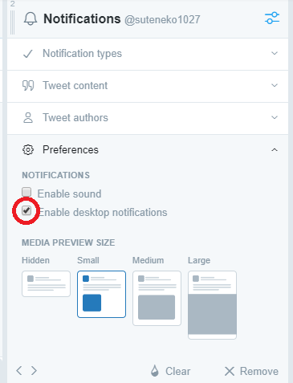

# Tweetdeck for Franz (with column notifications)

This is the Franz recipe for Tweetdeck

## REQUIRED

* [Franz](https://meetfranz.com/) 5 or later
  Do not support older version.

## HOW TO INSTALL

1. download the recipe-tweetdeck.
2. Open the Franz Plugins folder on your machine (note **that this `dev` directory may not exist yet, and you must create it**):
  * Mac: `~/Library/Application Support/Franz/recipes/dev/`
  * Windows: `%appdata%/Franz/recipes/dev/`
  * Linux: `~/.config/Franz/recipes/dev`
3. Copy the `recipe-tweetdeck` folder into the plugins directory
4. Restart Franz

See [Franz Recipe Documentation / Overview](https://github.com/meetfranz/plugins/blob/master/docs/integration.md)
 for details.

## USAGE

### COLUMN NOTIFICATION BADGE

If "Enable desktop notifications" (Tweetdeck column option) is enabled, you will be notified.
